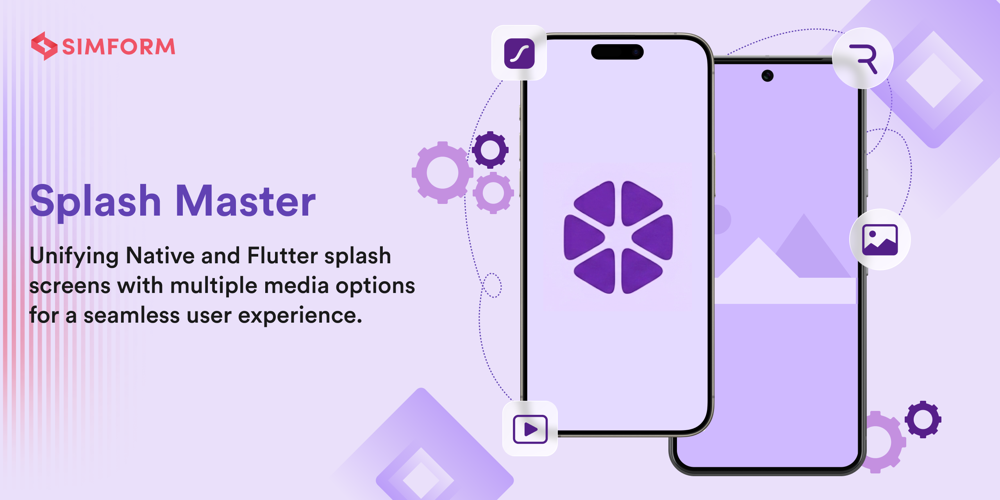

# Splash Master Video

[](https://github.com/SimformSolutionsPvtLtd/splash_master/blob/master/LICENSE)

Splash Master Video provides `SplashMasterVideo`, a Flutter splash widget for video-based splash flows.

## Features

- Video splash with automatic next-screen navigation
- Supports `AssetSource`, `DeviceFileSource`, `NetworkFileSource`, and `BytesSource`
- First-frame control via `SplashMasterVideo.initialize()` and `SplashMasterVideo.resume()`
- Playback/display customization via `VideoConfig`

## Documentation

Visit our [documentation](https://simform-flutter-packages.web.app/splashMaster) site for all implementation details, usage instructions, code examples, and advanced features.

## Installation

```yaml
dependencies:
  splash_master_video: <latest-version>
```

> Note: `splash_master_video` already includes `splash_master`, so you do not need to add `splash_master` separately.

### Minimal splash_master setup (`pubspec.yaml`)

```yaml
splash_master:
  color: '#FFFFFF'
  image: 'assets/splash.png'
```

Then run:

```bash
dart run splash_master create
```

For full key reference, check our [documentation](https://simform-flutter-packages.web.app/splashMaster).

## Support

For questions or issues, [create an issue](https://github.com/SimformSolutionsPvtLtd/splash_master/issues) on GitHub.

## License

This project is licensed under the MIT License. See [LICENSE](../../LICENSE).
